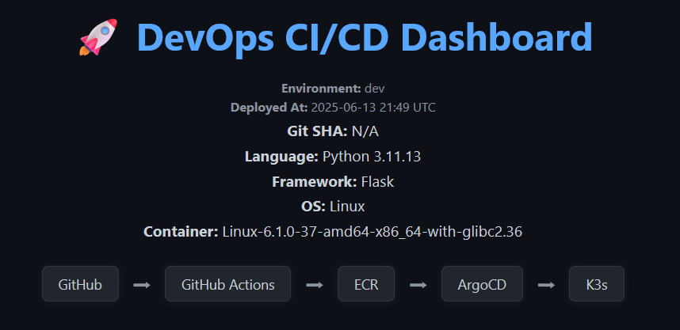

# 🚀 DemoApp: DevOps CI/CD Dashboard





A lightweight Flask application used for validating CI/CD pipelines, GitOps flows, and container orchestration in DevOps labs. This app is purpose-built for use with Kubernetes (K3s), ArgoCD, GitHub Actions, and AWS ECR.

## Purpose

This application serves as a **visual indicator and diagnostic dashboard** to verify:

- CI/CD pipeline functionality (GitHub → ECR → ArgoCD → K3s)
- Container builds and tag promotion
- Kustomize overlays (preview, staging, production)
- Image pull authentication (e.g., AWS ECR credentials)
- Runtime environment visibility (Git SHA, Python version, container OS, etc.)

It’s ideal for testing GitOps workflows, secret rotation, and automated deployments in sandbox or homelab clusters.

---

## Tech Stack

- **Language**: Python 3.11
- **Framework**: Flask
- **Container**: Docker
- **Kubernetes**: K3s
- **CD Tool**: ArgoCD
- **Registry**: AWS ECR

---

## 🗂 Directory Structure

```bash
apps/demoapp
├── app.py                  # Flask app serving the dashboard
├── Dockerfile              # Image build definition
├── requirements.txt        # Python dependencies
├── templates/index.html    # HTML template
├── static/style.css        # UI styling
├── namespace.yml           # K8s namespace definition
├── service.yml             # K8s service manifest
├── ingress.yml             # Ingress manifest
├── deployment.yml          # Base deployment
├── kustomization.yml       # Base kustomize config
├── base/                   # Clean base for Kustomize
├── overlays/               # Kustomize overlays: preview, staging, production
│   └── preview/            # Includes ECR creds Job and env-specific patches
